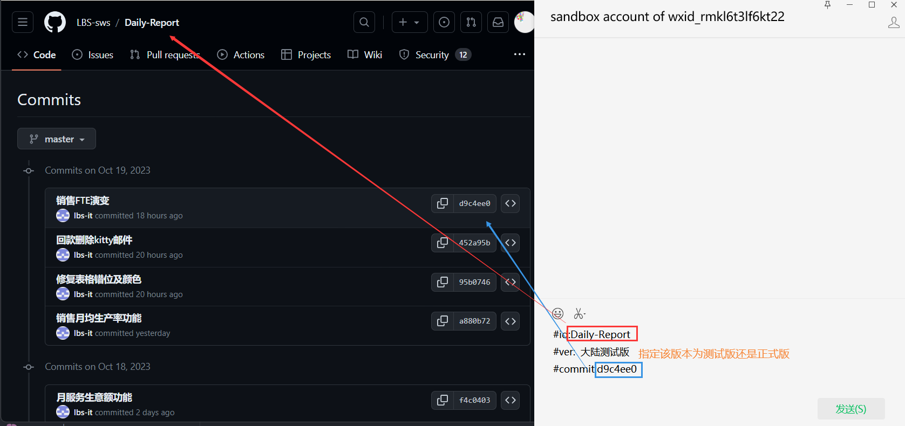

## 项目
- php: 5.4 ~ 5.5 (版本越高，php语法要求越严，当前项目语法较散乱)
- yii: 1.1.2
- mysql: 5.6 ~ 5.7

> 吐槽：
> 项目最佳php版本为<=5.3.但项目中有很多语法是>=5.4。推荐使用5.4~5.5
> 
> 所以如果使用<=5.3，那么>=5.4的才支持的写法，则需要你手动修改
> 
> 如果使用>=5.4,那么在<=5.3下不报错的散乱php写法，会在>=5.4冷不丁冒出来🫥🫡

LBS日常管理系统，是多系统集合项目，内含日报系统、人事系统、营运系统、销售系统等等

当前项目为**服务报告系统**

> 注：
> github上的代码是拆分的，如日报系统单独一个git仓库,人事系统单独一个git仓库...
> 但在使用运行时，都是按下面的文件结构整合、配置、使用。

## 系统文件结构
```
www  WEB部署目录（或者子目录）
├─AdminLTE       前端页面目录(子项目共用)
├─sv             sales-report 服务报告系统
│  ├─protected       应用目录
│  │  ├─....
│  │  │
│  │  └─config          路由定义文件
│  │    ├─....
│  │    ├─main.php         项目配置文件（含数据库配置）
│  │    ├─system.php       子系统配置文件
│  │    └─console.php      项目配置文件（定时器使用【php project_path/yii_console.php JobQueue】，例系统发送邮件，报表，定时更新数据库状态）
│  │  
│  └─...
│
├─dr             日报系统目录
├─hr             人事系统目录
├─acct           会计系统目录
├─....
│
├─yii            yii框架目录
├─README.md      README 文件
....
```

## 数据库配置、结构
该项目含有多个子系统，**每个子系统都有独立的自己的数据库**，
因此需在`/protected/config/main.php`、`/protected/config/console.php`中指定`host` `dbname` `username` `password`

#### 数据库配置
```php
// /protected/config/main.php
// dbname 设置为日报系统的数据库。
'db'=>array(
    'connectionString' => 'mysql:host=your_database_host;dbname=serviceuat',
    'emulatePrepare' => true,
    'username' => 'your_database_username',
    'password' => 'your_database_password',
    'charset' => 'utf8',
),
```

```php
// dr/protected/config/main.php
// 数据库后缀设置
'params'=>array(
    'envSuffix'=>'dev',
),
```
> 注：
> 数据库名
> `dev`后缀为本地开发
> `uat`后缀为线上测试;
> 空后缀、`prod`为线上正式;

#### 数据库结构
```
数据库服务器
├─serviceuat       日报系统数据库
│  ├─lbs_service_equipments
│  ├─lbs_service_material_lists
│  ├─....
│  └─lbs_service_use_areas
│
├─hruat           人事系统数据库
├─accountuat      会计系统数据库
....
```

## 项目配置

> 注：
> 项目访问最好使用ip,用域名有可能报错 --沈师兄

#### session 配置
```php
// dr/protected/config/main.php
// 不配置会无法登录
'session'=>array(
    'class'=>'CHttpSession',
    'cookieMode'=>'allow',
    'cookieParams'=>array(
        'domain'=>'your_domain_or_your_ip',
    ),
),
```

#### 子系统配置
```php
//根据使用情况开启
return array(
    'drs'=>array(
        'webroot'=>'your_domain_or_your_ip/dr',
        'name'=>'Daily Report',
        'icon'=>'fa fa-pencil-square-o',
    ),
    'acct'=>array(
        'webroot'=>'your_domain_or_your_ip/ac-new',
        'name'=>'Accounting',
        'icon'=>'fa fa-money',
    ),
    'ops'=>array(
        'webroot'=>'your_domain_or_your_ip/op-new',
        'name'=>'Operation',
        'icon'=>'fa fa-gears',
    ),
    'hr'=>array(
        'webroot'=>'your_domain_or_your_ip/hr-new',
        'name'=>'Personnel',
        'icon'=>'fa fa-users',
    ),
    .....
)
```

#### 伪静态
/根目录下

apache
```apache
#.htaccess
RewriteEngine on

# if a directory or a file exists, use it directly
RewriteCond %{REQUEST_FILENAME} !-f
RewriteCond %{REQUEST_FILENAME} !-d

# otherwise forward it to index.php
RewriteRule . index.php
```

nginx
```nginx
#nginx.htaccess

```


## 代码推送
1. 关注公众号：: sandbox account of wxid_rmkl6t3lf6kt22(最好让公司开发人员推送)
2. 将你的代码推送到github中，记住commitid
3. 编写记录 
```txt
LBS系統更新
#id:your_project_name 
#ver:  大陆测试版/大陆正式版
#commit:your_commitid
```
> 注：
> 1. 推送commit中**不要含有readme.md等文件**
> 2. commit 信息中不要有表情，不要有奇奇怪怪的字符，会通不过
> 3. 正式服推送时，**需保证代码在`main`分支中**，否则正式服中会将代码回滚
> 4. 每次推送，服务器**仅更新分支中含有的文件**，不会更新分支之前提交的文件。因此有多个分支时，使用`,`分支多个分支id
>    ```txt
>    LBS系統更新
>    #id:Daily-Report
>    #ver:  大陆正式版
>    #commit:f1xxx00,5exxx6c,5txxxoi
>    ```
> 5.

